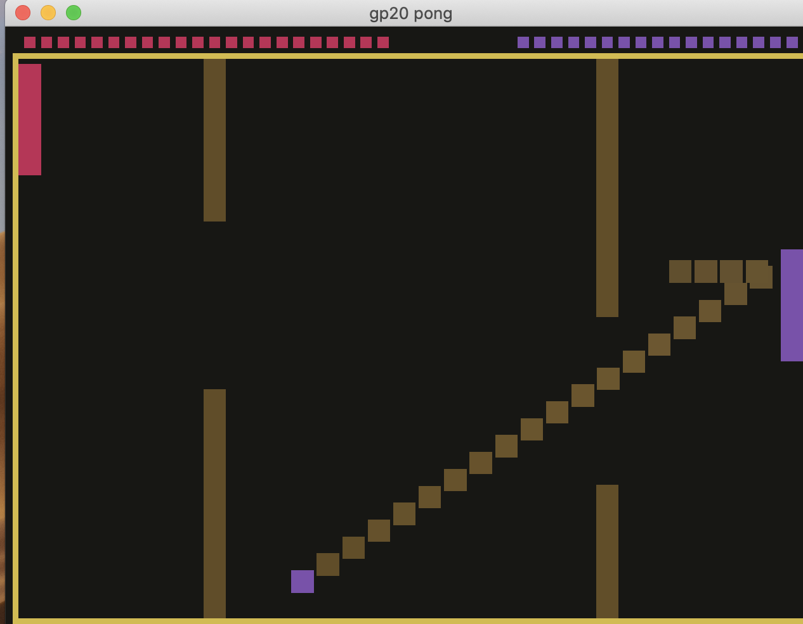

# Color Pong

Author: Qingyi Dong

Design: 
Both players have their own colors, and each of them is able to move the wall closer to them up or down by pressing "w"/"s". 
The target of each player is to let the ball of his color collide with the wall the other player is protecting but avoid it colliding with the wall he is protecting.

Screen Shot:

How To Play:

Instructions:
"w": move the middle wall up
"s": move the middle wall down
mouse control: move the left paddle

Strategies:
move the left handle and the middle wall in a way that the ball of your color cannot reach your wall and the ball of your opponent's color reaches yours.

This game was built with [NEST](NEST.md).
